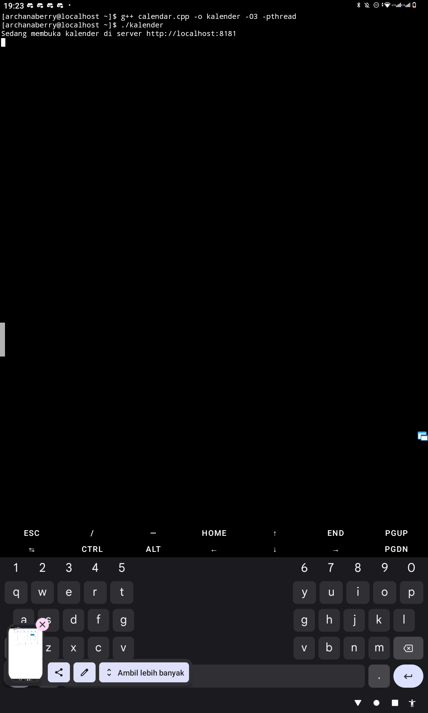
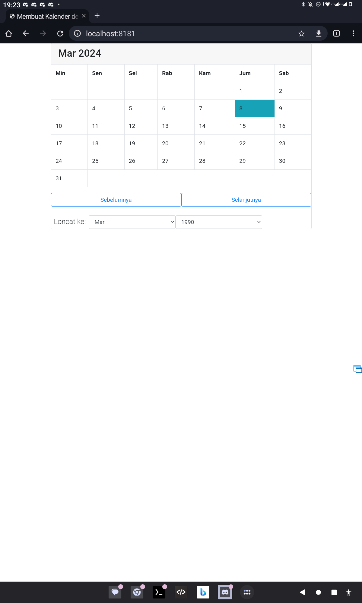

# kalendercpptml
kalender yang diprogramkan pakai html, js, css tetapi dijadikan C++ dengan performa yang cepat dan efisien XD

Ini lanjutan dari repo nya punya bambang [Akeno Buns Kalender](https://github.com/gryzzlaycutzy121/Kalender-Indonesia).

### Tangkapan Layar Pemakaiannya

* Bisa dijalankan lewat terminal apapun termasuk termux juga bisa

* Hasil akhir

